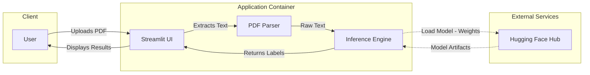

# Resumate: Classification of Resume Content

<div align="center">
    
</div>

<br>


Resumate is a deep learning application designed to classify text lines from resumes into specific section categories.

## 🚀 Live Demo
Try the application directly on Hugging Face Spaces:
**[👉 View Demo](https://huggingface.co/spaces/halhadad/resume-labeling-space)**

## Features
- **PDF Upload**: Parse and classify content directly from PDF files.
- **Text Input**: Manually paste resume text for instant classification.
- **7 Categories**: Classifies content into Education, Experience, Skills, Objective, Qualifications and Certificates, Personal Information, and Summary.

## 🏗️ System Architecture



## 🧠 Model Background
The core model is a DistilBERT transformer fine-tuned using the Hugging Face Trainer in PyTorch. It was trained on a custom dataset of approximately **80,000 resume text lines** to distinguish between 7 resume section categories (Edu, PI, Exp, Skill, Obj, QC, Sum).

## 🛠️ Installation & Setup

> [!IMPORTANT]
> **Private Model Access**: The default model (`halhadad/DistilBERT-NLP-Resume-TextClassifer-Lines`) is a **private repository**. You must have a valid Hugging Face token with access permissions to run this application locally.

### 1. Prerequisites
- **Python 3.10+**

### 2. Clone and Install
```bash
git clone https://github.com/halhadad/resume-text-classifier-app.git
cd resume-text-classifier-app
pip install -r requirements.txt
```

### 3. Configuration
You need to configure your environment to access the private model.

**Option A: .env File**
Create a `.env` file in the root directory:
```bash
ttk12_TOKEN=hf_your_actual_token_here
```

**Option B: config.json**
You can adjust settings in `config.json`:
```json
{
    "hf_repo_id": "halhadad/DistilBERT-NLP-Resume-TextClassifer-Lines",
    "use_local_model": false,
    "hf_token_env_var": "ttk12_TOKEN"
}
```

### 4. Running the App
```bash
streamlit run ui/Overview.py
```
